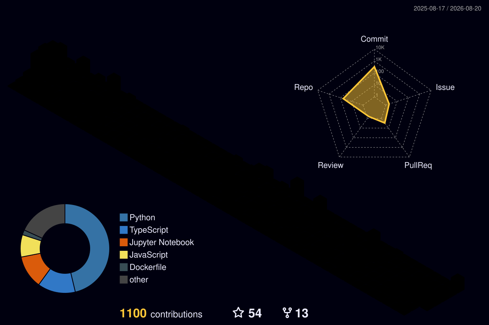

# Oisin Aeonn
### AI/ML Cloud Engineer @ AWS  ·  Bedrock, SageMaker & AgentCore  ·  Melbourne, Australia
#### (Pronounced "Ocean")

---

## About

I'm an AI/ML Cloud Engineer at AWS, working across Bedrock, SageMaker, and Bedrock AgentCore. Most of my work is helping enterprises get generative AI into production, building agentic systems and inference infrastructure, and finding the root causes of problems that others miss, often deep in service source code.

- **Currently:** AI/ML Cloud Engineer at Amazon Web Services (AWS), on the SageMaker / Bedrock / AgentCore team
- **Accreditation:** one of 7 accredited Bedrock AgentCore SMEs globally, and mentoring other engineers toward their own accreditation
- **Study:** Master of Information Technology (AI major) at the University of Melbourne
- **Earlier:** Bachelor of IT at RMIT (4.0 GPA, and the IT Prize as top final-year graduate)
- **Certifications:** 30+ across AWS, Azure, Oracle Cloud, and Cisco (including AWS Generative AI Developer Professional, Early Adopter)
- **WorldSkills:** represented Australia in Cloud Computing at Lyon 2024 (15th internationally); now an assistant trainer with WorldSkills Australia
- **Lifelong learner**, currently focused on: AI planning for autonomy, agentic AI systems, multi-agent orchestration, and advanced AgentCore development

---

## Focus Areas

---

## Tech Stack

**Cloud**

**Generative & Agentic AI**

**ML & Data Science**

**Languages**

**DevOps & Infrastructure**

**Data**

---

## Areas of Interest

- **AI / ML:** generative AI, multi-agent systems, RAG, model training and fine-tuning, inference optimisation, NLP, computer vision
- **Cloud & Architecture:** multi-cloud (AWS, Azure, GCP, OCI), serverless, microservices, infrastructure as code, high availability, cost optimisation
- **Agentic AI:** AgentCore, Bedrock Agents, MCP, A2A, and the frameworks it supports (Strands, LangGraph, LangChain, CrewAI, LlamaIndex)
- **Foundations:** algorithms, distributed systems, discrete mathematics, graph theory

---

## Beyond the Tech

When I'm not building, you'll usually find me with my dogs, tinkering with bikes and cars, reading about maths or astronomy, picking up bits of new languages, or volunteering.

---

## Current Side Project

**LookGlass** ([lookglass.net](https://lookglass.net/)): building at the intersection of cloud and AI.

---

## Dashboard

My GitHub contribution activity, in 3D (auto-updated daily):

---

## Philosophy

> "The future remembers those who build it, and those who didn't."

---

## Get in Touch

The best way to reach me is on [LinkedIn](https://www.linkedin.com/in/aeonn/). Always happy to talk cloud, AI/ML, agentic systems, or WorldSkills.
